# `whoami` -> bismarck423

  

---

## About Me

- Status: 网络空间安全本科生 / 探索全栈开发与AI智能体工作流
- Focus: 兼顾网络安全基础设施、Web安全开发以及系统健壮性
- Collaboration: 乐于交流底层技术、数据处理逻辑或解决棘手的网络环境问题
- Contact Ping: `2384722295@qq.com`

---

## Tech Stack

### Cybersecurity & Infrastructure

### Development & Data

### Database

---

## Telemetry

  
  
  
  

    

  
  
    
  
  

  

  
  

    > SIGNAL ACQUIRED: bismarck423 // SECURE LINK ESTABLISHED
  

